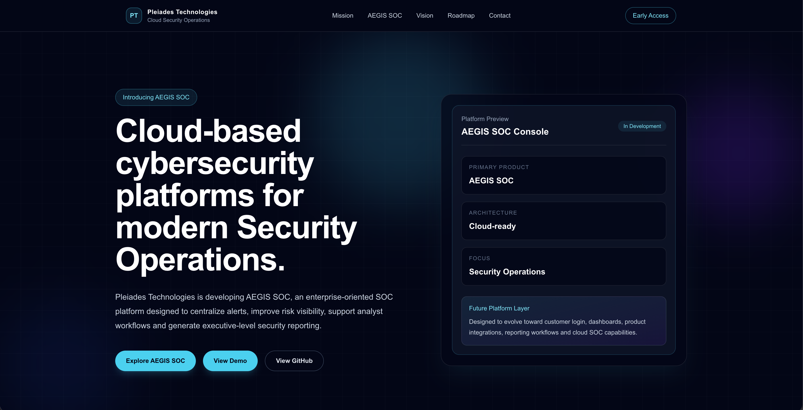
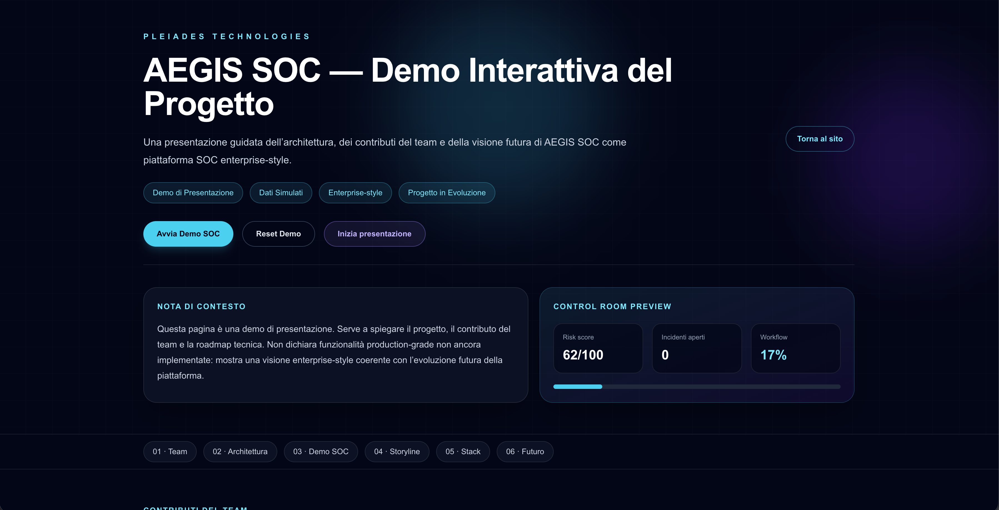
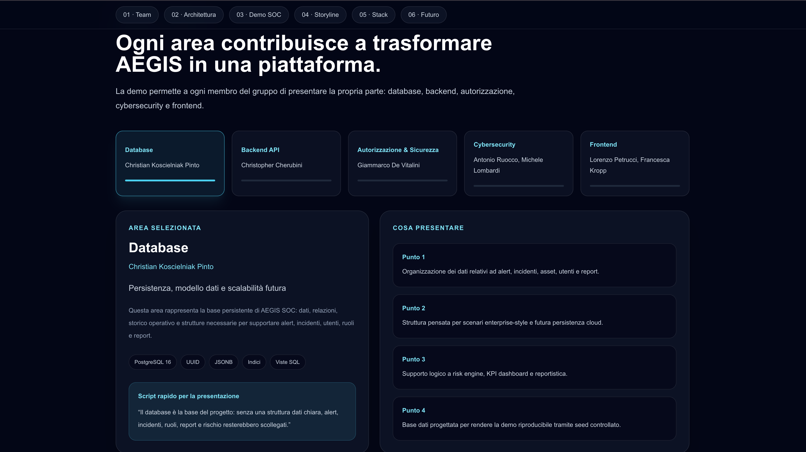
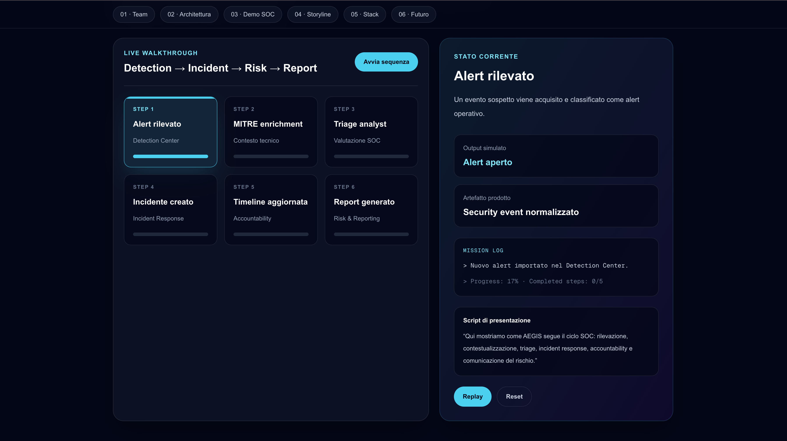

# Pleiades Technologies Website

Official public website for **Pleiades Technologies**, the team building
cloud-based cybersecurity products for modern Security Operations.

Live site: [pleiades-technologies-website.vercel.app](https://pleiades-technologies-website.vercel.app/)

The website currently introduces the company vision and presents **AEGIS SOC**,
the first product in development: an enterprise-style SOC platform focused on
alert triage, asset and vulnerability visibility, incident response workflows,
MITRE ATT&CK mapping, auditability and executive/technical reporting.



## Repository Scope

This repository is the **public-facing web presence** for Pleiades Technologies.
It is separate from the main AEGIS product repository, where the backend,
database schema, FastAPI services, PostgreSQL foundation and operational SOC
platform work are being developed.

The goal of this site is to:

- Present Pleiades Technologies as a cloud cybersecurity company.
- Explain the direction of AEGIS SOC without overstating unfinished product
  capabilities.
- Provide a clean public entry point for demos, future product pages and
  early-access communication.
- Support presentation workflows for the team while the full platform evolves.

## Current Experience

| Route | Purpose | Status |
| --- | --- | --- |
| `/` | Public landing page for Pleiades Technologies and AEGIS SOC | Implemented |
| `/demo` | Interactive project presentation for AEGIS SOC | Implemented |

The homepage includes:

- Company positioning and mission.
- AEGIS SOC product preview.
- Future platform vision.
- Roadmap from public site to product ecosystem.
- Contact and early-access call to action.

The demo page includes:

- Team contribution sections.
- Architecture and responsibility breakdown.
- Simulated SOC workflow narrative.
- Risk/reporting storyline.
- Stack and future roadmap.



### Demo Presentation Screens

The interactive demo is designed as a guided presentation surface. It gives the
team a structured way to explain both the engineering ownership areas and the
SOC workflow behind AEGIS.



The live walkthrough section turns the product story into a step-by-step SOC
sequence: detection, enrichment, triage, incident response, accountability,
risk communication and reporting.



## Product Context: AEGIS SOC

AEGIS SOC is being designed as an enterprise-oriented Security Operations Center
platform. The broader product direction includes:

- Asset inventory and vulnerability management.
- Security alert centralization and triage.
- MITRE ATT&CK enrichment.
- Incident response and timeline tracking.
- Audit logging and role-aware access control.
- Risk scoring and reporting for technical and executive stakeholders.

The current product foundation, in the separate AEGIS repository, is strongest
on the backend/database side: PostgreSQL schema design, FastAPI services,
authentication, RBAC, seed data and database-level risk analytics. This website
acts as the public narrative layer around that product work.

## Tech Stack

| Layer | Technology |
| --- | --- |
| Framework | Next.js 16 App Router |
| UI | React 19 |
| Language | TypeScript |
| Styling | Tailwind CSS 4 |
| Deployment target | Vercel |

## Project Structure

```text
.
|-- public/
|   `-- readme/              # README screenshots
|-- src/
|   |-- app/                 # App Router pages and metadata
|   |-- components/
|   |   |-- demo/            # Interactive demo experience
|   |   |-- effects/         # Intro and visual effects
|   |   |-- layout/          # Navbar and footer
|   |   |-- sections/        # Homepage sections
|   |   `-- ui/              # Shared UI primitives
|   `-- data/                # Site-level configuration
|-- package.json
|-- next.config.ts
|-- tsconfig.json
`-- README.md
```

## Local Development

Install dependencies:

```bash
npm install
```

Start the development server:

```bash
npm run dev
```

Open:

```text
http://localhost:3000
http://localhost:3000/demo
```

Build for production:

```bash
npm run build
```

Run linting:

```bash
npm run lint
```

## Development Notes

- Keep this repository focused on the public website and presentation layer.
- Do not copy backend/database responsibilities into this repo.
- Product claims should stay aligned with the actual AEGIS implementation
  status.
- Future product UI screenshots should come from the real product interface,
  not from unrelated mockups.
- When adding Next.js code, read the local Next.js 16 documentation in
  `node_modules/next/dist/docs/` first, as this project uses APIs and
  conventions that may differ from older Next.js versions.

## Roadmap

1. Expand the AEGIS SOC product page with feature sections and real product
   screenshots.
2. Add a clearer early-access or contact workflow.
3. Connect public messaging to future customer login and protected product
   surfaces.
4. Add case-study style content once the operational dashboard is mature.
5. Keep README screenshots refreshed when the public design changes.
